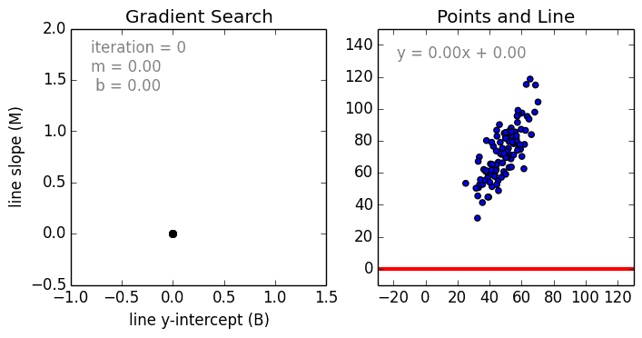

# Machine learning algorithms
Explanation with examples of main machine learning algorithms.

## Содержание
* [Определение](#definition)
* Виды алгоритмов машинного обучения
    * [обучение с учителем (supervised learning)](#supervised_learning)
        * [линейная регрессия](#linear_regression)
        * [классификация](#classification)
    * [обучение без учителя (unsupervised learning)](#unsupervised_learning)
    * полу-контролируемое обучение (semi-supervised learning)
    * обучение с подкреплением (reinforcement learning)
* [Примеры на python](#examples_on_python)
* [Ссылки](#links)

## Определение
Машинное обучение - набор алгоритмов и статистических моделей, которые используются компьютерами для выполнения 
конкретной задачи без использования явных инструкций, полагаясь на шаблоны проектируемых моделей. Машинное обучение 
рассматривается как подмножество искусственного интеллекта. ML алгоритмы строят математическую модель на основе 
выборочных данных (обучающая выборка) для того, чтобы делать прогнозы и примать решения без явного программирования.

В зависимости от конкретной задачи, от формы и качества обучающих данных зависит выбор алгоритма для обучения модели.
Далее будут рассмотрены типы алгоритмов машинного обучения, краткое описание их работы и области применения для каждого из них.

## Обучение с учителем (supervised learning)
В обучении с учителем у нас есть набор входных данных X и набор результируюзих данных Y. 
Цель алгоритма - вывести функцию, которая по новому набору входного параметра x выдаст верное значение функции y = f(x).

### Линейная регрессия
Линейная регрессия - это процесс моделирования отношений между зависимой переменной с заданным набором независимых переменных.
Различают простую линейную регрессия, когда у нас есть только одна независимая перменная и множественную регрессию, 
когда независимых переменных больше, чем одна.

Представление линейной регрессии - линейная функция, которая принимает один (или несколько) аргументов x и 
решением которой является значение функции - y. Задача линейной регрессии - подобрать такие коэффициенты 
перед иксами и такой коэффициент смещения (например, перемещающий функцию вверх и вниз на двумерном графике), 
которые бы максимально точно отражали поведение всех наших наблюдений (data points).

Например, в простой задачи линейной регрессии (один x и один y) форма модели будет иметь вид:

`y = b0 + b1 * x`

`b0` - коэффициент смещения

`b1` - коэффициент при y

`x` - независимая перменная

`y` - зависимая переменная

При больших размерностях, когда мы работаем больше, чем с одним x, мы работаем с гиперплоскостью.
В общем виде уравнение для нескольких линейных регрессий с `p` независимых переменных имеет вид:

Для минимизации ошибки можно использовать метод наименьших квадратов. Его суть заключается в том, чтобы 
выбрать нужные коэффициенты при минимальной MSE (среднеквадратичной ошибке).

На небольшом наборе данных можно использовать стандартные формулы для нахождения коэффициентов, 
которые будут рассмотрены в примере чуть позже. Однако, если набор данных очень большой, то более рационально 
воспользоваться градиентным спуском, который позволяет оптимизировать значение коэффициентов путем итеративной 
минимизации ошибки модели в тренировочных данных.

Принцип работы следующий. Спуск начинается с случайных значений лдя каждого коэффициента. 
Сумма квадратов ошибок рассчитывается для каждой пары входных и выходных значений. 
Каждый из коэффициентов обновляются в направлении минимизации ошибки. Процесс повотряется до тех пор, пока не 
будет достигнута минимальная квадраьичная ошибка или дальнейшее улучшение будет невозможно или достигнут 
изначальный порог интерации градиентного спуска.

Линейная регрессия - самый популярный метод в машинном обучении, который имеет множество областей применения, например:
* изучение производительности двигателя по данным испытаний в автомобилях
* моделирование причино-следственных связей между параметрами в биологических системах
* анализ данных о погоде
* исследование рынка, анализ результата опроса клиентов
* прогнозирование уровня доверия к клиенту банка

[Примеры линейной регрессии на python](#examples_on_python)

## Классификация
Классификация - процесс прогнозирования класса заданных data points. Задача классификации - 
прогнозирование функции отображения (f) из входных переменных (X) в дискретные величины (Y).

Например, обнаружение спама в email рассылках может классифицироваться, как задача классификации. 
Это двоичная классификация, т.к. здесть только два класса: спам и не спам. Классификатор использует обучаемую выборку, 
чтобы понять, как входные параметры влияют на класс. 

Выделяют два основных типа классификаторов - lazy and eager ones.
1. Lazy learners работают с тестовой выборкой без предварительного обучения (k-nearest neighbor, Case-based reasoning)
2. Eager learners, наоборот, тратят много времени на обучение и мало на прогнозирование

Один из самых популярных методов классификации - метод KNN (k Nearest Neighbor)
Алгоритм KNN предполагает, что подобные вещи существуют в непосредственной близости друг от друга.

 
## Обучение без учителя (unsupervised learning)
В обучении без учителя у нас есть только входные данные без результирующих. 
Цель обучения без учителя - спроектировать специальное распределение, которое можно 
интерпретировать как результирующую выборку, чтобы больше узнать о наших данных.

## Примеры на python
* [Простая линейная регрессия](https://github.com/AndreyVolkovBI/machine-learning-algorithms/blob/master/example/linear-regression/1_simple_linear_regression.py)
* [Простая линейная регрессия с градиентным спуском](https://github.com/AndreyVolkovBI/machine-learning-algorithms/blob/master/example/linear-regression/2_simple_linear_regression_with_gradient_descending.py)
* [Множественная линейная регрессия](https://github.com/AndreyVolkovBI/machine-learning-algorithms/blob/master/example/linear-regression/3_multiple_linear_regression_mlr_taxi.py)

## Ссылки

[Linear regression](https://hackernoon.com/linear-regression-and-its-mathematical-implementation-sc1ql24o8)

[Gradient descent](https://spin.atomicobject.com/2014/06/24/gradient-descent-linear-regression/)

[Classification](https://towardsdatascience.com/machine-learning-classifiers-a5cc4e1b0623)

[Классификатор kNN](https://habr.com/ru/post/149693/)

[K-Nearest Neighbors Algorithm](https://towardsdatascience.com/machine-learning-basics-with-the-k-nearest-neighbors-algorithm-6a6e71d01761)